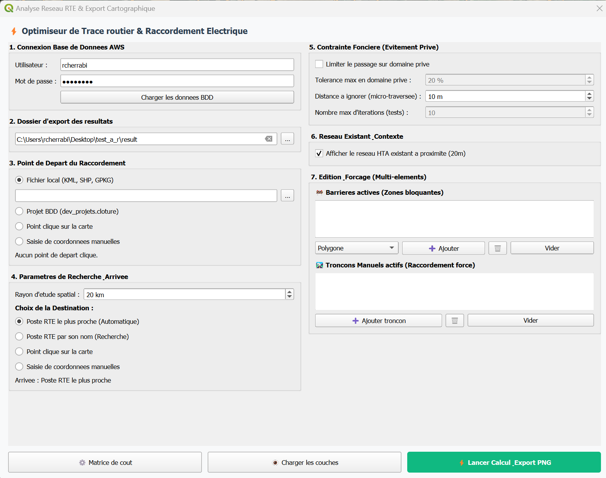

## ⚡ RTE-Connect — Optimiseur de Tracé Routier & Raccordement Électrique

Extension PyQGIS d'analyse spatiale de réseau et d'aide à la décision technico-économique pour le raccordement de centrales EnR aux postes sources RTE / Enedis.   

---

## 📌 Enjeux & Intérêt métier de l'outil

Dans tout projet de parc photovoltaïque, le raccordement au réseau électrique représente le premier facteur de risque technico-économique. Les estimations traditionnelles à vol d'oiseau s'avèrent irréalistes : les câbles souterrains doivent obligatoirement emprunter le domaine public routier, contourner des obstacles naturels et respecter des servitudes de passage, ce qui engendre un allongement réel de 20 % à 40 % par rapport à la distance géodésique directe.   

**RTE-Connect** résout cette problématique en modélisant le réseau routier sous forme de graphe vectoriel topologique. Grâce à une adaptation avancée de l'algorithme de Dijkstra, l'outil arbitre en quelques secondes entre :   

📏 Le tracé géométriquement le plus court.   
💶 Le tracé technico-économique le plus économique, privilégiant les linéaires à moindre coût unitaire de tranchée (pistes agricoles, chemins ruraux) même au prix d'un léger détour, tout en intégrant les surcoûts d'ouvrages d'art.   

---

## 🎯 Définition flexible du tracé

Pour s'adapter à la maturité et aux formats de chaque étude, l'opérateur configure les extrémités du tracé via 4 modes au choix :   

**📍 1. Point de départ (Origine du projet)**

📁 Fichier local : import direct de périmètres aux formats vectoriels standards (KML, SHP, GPKG) avec reprojection automatique en Lambert-93.   
🗄️ Projet en base de données : sélection directe des polygones de clôture hébergés sur le serveur spatial PostgreSQL/PostGIS de l'entreprise.   
🖱️ Pointage interactif : clic direct sur le canevas cartographique QGIS avec accrochage (snapping) automatique à l'axe routier le plus proche.   
✍️ Saisie de coordonnées numériques : encodage manuel des coordonnées en Lambert 93 (X/Y) ou en WGS 84 (Lon/Lat) avec conversion instantanée.   

**🎯 2. Point d'arrivée (Destination du raccordement)**

🤖 Poste RTE le plus proche (Automatique) : scanne les postes sources dans un rayon paramétrable (ex. 20 km) et identifie la cible optimale.   
🏷️ Sélection ciblée par nom : filtrage textuel et choix direct du poste source dans le référentiel national.   
🖱️ Point cliqué sur l'interface : idéal pour simuler un piquage sur une ligne HTA existante repérée sur le terrain.   
✍️ Saisie de coordonnées manuelles : définition libre d'un point d'injection précis (Lambert 93 ou WGS 84). 

---

## 🖥️ Interface de commande

### Console de pilotage PyQt

---

## ⚙️ Paramétrage avancé & Contraintes de franchissement

L'outil offre une grande finesse d'arbitrage pour sécuriser la faisabilité foncière et technique :   

🛡️ Maîtrise du foncier privé : seuillage strict du nombre maximal de parcelles privées cadastrées pouvant être traversées, afin de limiter la complexité des négociations et des servitudes amiables.   

🚫 Zones d'exclusion personnalisées : possibilité de matérialiser des polygones d'évitement strict (zones de travaux, conflits de voirie, sensibilités locales) pour forcer l'algorithme à recalculer un contournement.

✏️ Édition manuelle & Forçage de passage :
        Ajout direct de tronçons manuels pour combler d'éventuelles discontinuités du réseau filaire.
        Forçage de passage sur des axes spécifiques préconisés par les gestionnaires de réseau.
        Prise en compte de forages dirigés pour franchir des zones inconstructibles en tranchée ouverte.
